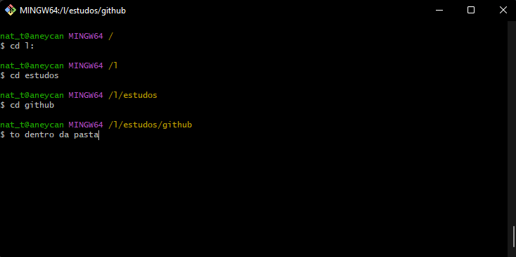
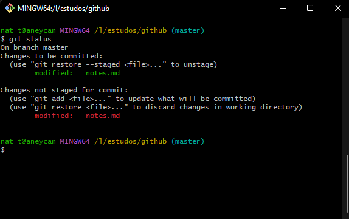
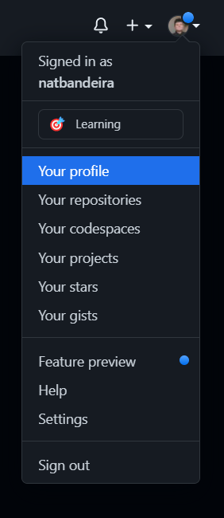
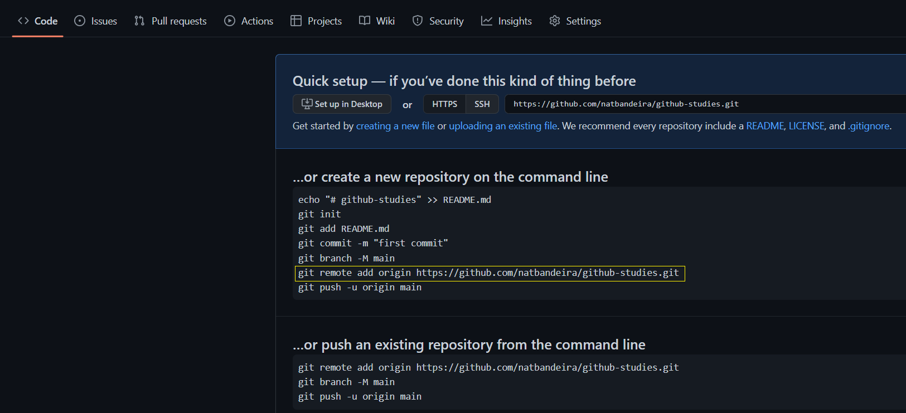
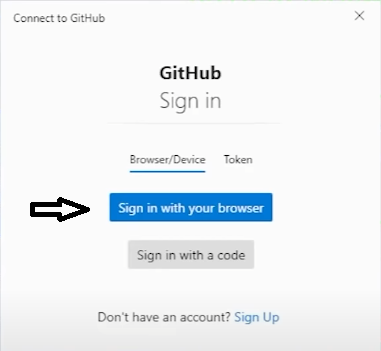

# Commit usando linhas de comando
* O primeiro passo é instalar o [Git](https://git-scm.com/downloads). Escolha a versão do seu Sitema Operacional e faça o download. A instalação não tem detalhes importantes, podendo apenas ir avançando até o final. 

* Feito isso, precisamos configurar o Git Bash, e de acordo com sua [documentação](https://git-scm.com/book/en/v2/Getting-Started-First-Time-Git-Setup), basta utilizar os comandos: 
</br>
```$ git config --global user.name "seuNomeGithub" ```
</br>
```$ git config --global user.email seuEmailGitHub@examplo.com```

   Nenhuma mensagem de confirmação irá aparecer. Para ver o que ficou salvo, digite:
</br>
```$ git config --global user.name ```
</br>
```$ git config --global user.email```

* Agora precisamos acessar a pasta (diretório) onde estão os arquivos que você deseja comittar. Para acessar um diretório, utilize o comando: </br>
```$ cd nomeDoDiretorio```
</br>
</br>
    > *No exemplo abaixo, estou acessando a pasta "github", que está dentro de "estudos" que está no meu hd L:*

    > 

    > *Caso queira voltar para a pasta a anterior, use o comando: ```cd ..```*

* Quando utilizarmos o comando:
  </br>
```$ git init```
  
  
   Será criado um repositório do Git na pasta do seu projeto, com todas as configurações que ele irá precisar para funcionar. Caso queira visualizar o repositório, basta habilitar a opção "exibir itens ocultos" do seu explorador, mas **não altere nada nele.**

* Criado o repositório .git, precisamos identificar quais arquivos iremos enviar para o seu repositório lá no servidor do Github, utilizando o comando:
</br>

    ```$ git add nomeDoArquivo.extensao ``` - *para add 1 arquivo por vez.*
</br>

    ou
</br>

    ``` $ git add * ``` -  *para add todos os arquivos do diretório.*

   Após essa etapa, os arquivos ficarão em **stage**, ou em estágio de preparação. Adicionar algo ao **stage** no git, permite que você continue fazendo modificações no seu diretório de trabalho e, quando decidir que quer interagir com o controle de versão, permite que guarde as mudanças em pequenos commits.

   Para conferir o que tem no seu **stage**:
   </br>
    ```$ git status ``` 
   </br>

    
    </br>
* Se quisermos resetar o stage/branch:
</br>
    ```$ git reset ``` 
</br>

* Agora estamos prontos para preparar os arquivos que estão em **stage**, pra poder enviar para o seu servidor no Github. Ou seja: **commitar**:
</br>
    ```$ git commit -m "nome do commit" ``` 
</br>
    > *Lembre-se que o nome do seu **commit** descreve a publicação que você está fazendo, seja descritivo, claro e objetivo*.

* Se você já criou repositório no Github, pule esta etapa. Caso ainda não tenha criado, vá até o seu perfil no [Github](https://github.com/):
 </br>

     
  
* Procure por "repositories" e clique em no botão "new" verde, a direita:
</br>

    


* Dê um nome ao seu repositório e lembre-se que o nome é o que descreve seu projeto. Clique em "create repository". Você deve ser redirecionado para uma página como essa. Utilize o comando destacado no print:
</br>

    
    > *Ao inves de usar ctrl + v no terminal, use shift + insert!*

    > Este comando indica a origem para onde você está enviando remotamente seu commit.

* Agora basta fazer o ```git push``` para "empurrar" seu commit para o local de origem que você indicou acima:
</br>
    ```$ git push -u origin master ``` 
</br>

* Como é um repositório novo e sua url é pública, por questões de segurança, você deve se autenticar. Clique em "sign in with your browser":
    
</br>

* Você deve receber uma confirmação no próprio terminal do Bash e agora é só dar F5 na página do seu repositório, que os arquivos estarão lá! 


